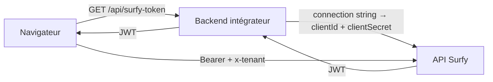

# Authentification

Le SDK appelle l'API Surfy avec un **JWT Bearer**. Le secret client (`clientSecret`) ne doit **jamais** être exposé dans le navigateur.

## Modèle recommandé



1. Votre **backend** parse `SURFY_CONNECTION_STRING` (`host` / `client_id` / `client_secret`), puis échange les credentials contre un JWT (`POST /api/v1/authentication/token` — voir [API Surfy](/apidocs/)).
2. Votre **frontend** appelle votre endpoint (ex. `/api/surfy-token`) et passe le token au SDK via `setAccessTokenProvider`.

## Côté SDK

```ts
const el = document.querySelector('surfy-floor-layout-2d')!;

el.setAccessTokenProvider(async () => {
  const response = await fetch('/api/surfy-token');
  if (!response.ok) {
    throw new Error(`Token request failed (${response.status})`);
  }
  const { token } = await response.json();
  return token;
});
```

:::warning Obligatoire
Appelez `setAccessTokenProvider()` **avant** le premier chargement réussi du plan (idéalement avant d'attacher l'élément au DOM ou dès sa création).
:::

## En-têtes envoyés par le SDK

| En-tête | Valeur |
|---------|--------|
| `Authorization` | `Bearer <token>` |
| `x-tenant` | Attribut `tenant` du composant |
| `accept-language` | Attribut `locale` (défaut `en`) |
| `Content-Type` | `application/json` |
| `X-Surfy-Sdk-Version` | Version du SDK |

## Exemple backend (Node / Express)

Préférez une **connection string** unique (Key Vault / CI) plutôt que des variables séparées :

```text
host=https://app.example.surfy.pro;client_id=<tenant>;client_secret=<api-key>
```

Alias acceptés : `endpoint` / `clientId` / `clientSecret`.

```ts
type SurfyApiConnection = {
  host: string;
  clientId: string;
  clientSecret: string;
};

function parseSurfyConnectionString(raw: string): SurfyApiConnection {
  const state: Partial<SurfyApiConnection> = {};
  for (const segment of raw.trim().split(';')) {
    const piece = segment.trim();
    if (!piece) continue;
    const eq = piece.indexOf('=');
    if (eq <= 0) throw new Error(`Invalid segment "${piece}"`);
    const key = piece.slice(0, eq).trim().toLowerCase();
    const value = piece.slice(eq + 1).trim();
    if (!value) throw new Error(`Missing value for "${key}"`);
    if (key === 'host' || key === 'endpoint') state.host = value.replace(/\/$/, '');
    else if (key === 'client_id' || key === 'clientid') state.clientId = value;
    else if (key === 'client_secret' || key === 'clientsecret') state.clientSecret = value;
    else throw new Error(`Unknown key "${key}"`);
  }
  if (!state.host || !state.clientId || !state.clientSecret) {
    throw new Error('Connection string must include host, client_id, client_secret');
  }
  return state as SurfyApiConnection;
}

// Env: SURFY_CONNECTION_STRING=host=…;client_id=…;client_secret=…
// POST {host}/api/v1/authentication/token — body: { clientId, clientSecret }

app.get('/api/surfy-token', async (_req, res) => {
  const { host, clientId, clientSecret } = parseSurfyConnectionString(
    process.env.SURFY_CONNECTION_STRING ?? '',
  );

  const response = await fetch(`${host}/api/v1/authentication/token`, {
    method: 'POST',
    headers: { 'Content-Type': 'application/json' },
    body: JSON.stringify({ clientId, clientSecret }),
  });

  if (!response.ok) {
    return res.status(response.status).json({ error: 'Auth failed' });
  }

  const data = await response.json();
  return res.json({ token: data.token });
});
```

## Erreurs d'authentification

Écoutez `surfy:error` sur l'élément :

```ts
el.addEventListener('surfy:error', (event) => {
  const { code, message } = event.detail;
  // AUTH_EXPIRED, AUTH_FORBIDDEN, SDK_CONFIG, ...
  console.error(code, message);
});
```

| Code | Signification |
|------|----------------|
| `AUTH_EXPIRED` | JWT expiré ou invalide (HTTP 401) |
| `AUTH_FORBIDDEN` | Accès refusé à l'étage (HTTP 403) |
| `SDK_CONFIG` | `setAccessTokenProvider` ou attribut requis manquant |

Renouvelez le token dans votre provider : il est rappelé à chaque chargement de layout.
