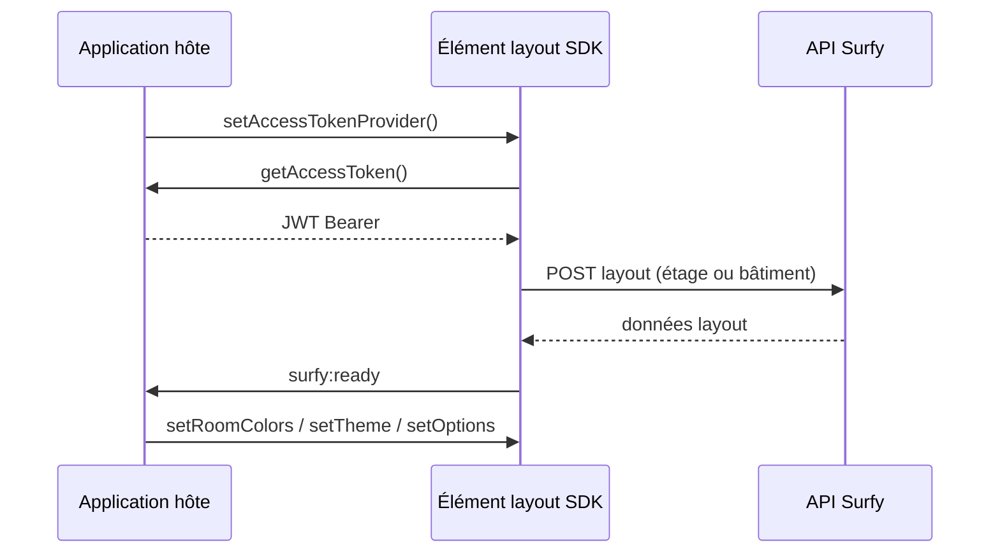

# Surfy SDK — intégration cartographie

Le **Surfy SDK** (`@surfy/surfy-sdk`) expose la cartographie Surfy aux applications tierces via des **Web Components** :

| Élément | Rendu | Statut |
|---------|-------|--------|
| `<surfy-floor-layout-2d>` | Plan d'étage 2D (SVG) | **Disponible** |
| `<surfy-building-layout-3d>` | Bâtiment 3D multi-étages (CubyV2) | **Disponible** (alpha SDK) |
| `<surfy-floor-layout-3d>` | Plan d'étage 3D (CubyV2) | Spécifié — enregistrement à venir |

Les éléments disponibles partagent la **même API** : authentification JWT, `setRoomColors` / `clearRoomColors`, `setTheme`, événements `surfy:ready`, `surfy:room-selected`, `surfy:room-hover`, `surfy:error`. Le bâtiment 3D ajoute `setOptions` et `fitToView`.

```html
<surfy-floor-layout-2d
  floor-id="10065"
  tenant="surfy-demo"
  base-url="https://app.surfy.pro"
></surfy-floor-layout-2d>
```

Chaque composant charge ses données dans un **Shadow DOM** (styles isolés).

## Statut des fonctionnalités

| Fonctionnalité | Statut |
|----------------|--------|
| `<surfy-floor-layout-2d>` | Disponible — zoom, sélection d'espaces |
| `setRoomColors` / `clearRoomColors` | Disponible (2D SVG + bâtiment 3D CubyV2) |
| `setTheme` | Disponible (tous les éléments enregistrés) |
| `fill-parent` | Disponible (2D et bâtiment 3D) |
| `<surfy-building-layout-3d>` | Disponible — CubyV2, `setOptions`, `fitToView` |
| `<surfy-floor-layout-3d>` | Tag réservé — pas encore enregistré dans le package |
| `setOptions` / `fitToView` | Disponibles sur **bâtiment 3D** ; no-op sur 2D pour l'instant |

Version publiée : constante `SURFY_SDK_VERSION` (semver du package npm).

## Principe d'intégration



1. L'hôte enregistre une fonction qui fournit un **JWT court** (jamais le `clientSecret` côté navigateur).
2. Le SDK récupère les données layout via l'API Surfy.
3. L'hôte écoute les événements DOM et pilote le rendu (couleurs, thème, options 3D, taille).

## Guides

| Page | Contenu |
|------|---------|
| [Installation](./installation.md) | npm, enregistrement des custom elements |
| [Authentification](./authentication.md) | JWT, tenant, proxy backend |
| [Éléments de layout](./layout-elements.md) | API commune + 2D / 3D / bâtiment |
| [Thème (MUI)](./theme.md) | `setTheme`, `SurfyThemeOptions` |
| [Options 3D](./options-3d.md) | `setOptions`, `fitToView` (bâtiment 3D) |
| [Couleurs des espaces](./room-colors.md) | `setRoomColors`, plusieurs pièces |
| [Taille et conteneur](./layout-and-sizing.md) | CSS, attribut `fill-parent` |
| [Intégration React](./react-integration.md) | Exemple complet TypeScript |
| [Maintenir la documentation](./maintenance.md) | Cohérence doc ↔ code SDK |

## Démo de référence

Le dépôt **surfy-sdk-demos** (monorepo public) contient :

- `apps/react-web` — démo Vite + React avec **trois onglets** : étage 2D, étage 3D (placeholder), bâtiment 3D
- `apps/demo-server` — proxy d'authentification (`clientId` / `clientSecret` côté serveur uniquement)
- tests Playwright E2E (chargement 2D, bâtiment 3D, couleurs, thème)

Chaque onglet correspond à un tag Web Component documenté dans [Éléments de layout](./layout-elements.md).

## Ce que le SDK n'est pas

- Ce n'est **pas** un export React du Work Canvas Surfy : React, MUI et Jotai sont **bundlés dans le Shadow DOM**.
- Le CSS de votre application **ne pénètre pas** le plan (par design). Utilisez les méthodes et attributs publics.
- Les secrets (`clientSecret`) restent **côté serveur**.
