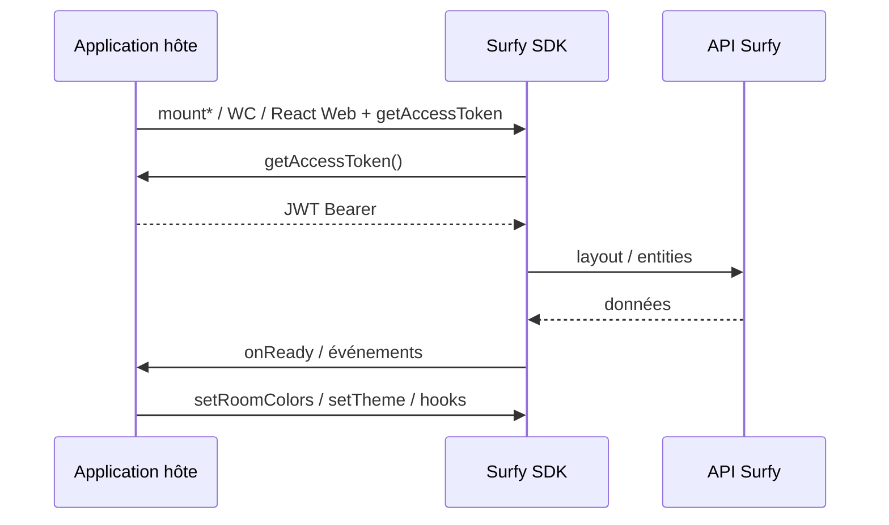

# Surfy SDK — intégration cartographie

Le **Surfy SDK** (`@surfy/surfy-sdk`) permet d'embarquer un **plan d'étage 2D** ou un **bâtiment 3D** Surfy en **lecture seule** (couleurs, zoom, sélection, thème) — sans reconstruire la géométrie Surfy et **sans** exposer le `clientSecret` dans le navigateur.

## Trois surfaces (+ API données)

Les trois surfaces de layout partagent les **mêmes sémantiques** (auth JWT machine, tenant, couleurs, sélection). Choisissez selon votre stack :

| Surface | Import | Public cible |
|---------|--------|--------------|
| **API JavaScript** | `@surfy/surfy-sdk` → `SurfySdk.mountFloor2d` / `mountBuilding3d` | HTML, Vue, Angular, tout hôte DOM |
| **Web Component** | mêmes tags (`surfy-floor-layout-2d`, `surfy-building-layout-3d`) | Markup HTML / frameworks non-React |
| **Surfy React Web** | `@surfy/surfy-sdk/react` | Apps React (préféré dans une app React Surfy ou tierce) |
| **API données client** | `@surfy/surfy-sdk/client` → `SurfyClient` | Backend ou navigateur — bâtiments / étages / espaces |

```ts
import { SurfySdk } from '@surfy/surfy-sdk';

const layout = SurfySdk.mountFloor2d({
  container: '#map',
  tenant: 'mon-tenant',
  baseUrl: 'https://app.surfy.pro',
  floorId: 10065,
  getAccessToken: () => fetchToken(),
});
```

Handle `SurfyLayout` : `setRoomColors`, `setTheme`, `updateRoom`, `setFillParent`, callbacks `onReady` / `onRoomSelected` / `onRoomHover` / `onError`, `destroy()`. Le bâtiment 3D ajoute `setOptions` et `fitToView`.

## Statut des fonctionnalités

| Fonctionnalité | Statut |
|----------------|--------|
| `SurfySdk.mountFloor2d` / `mountBuilding3d` | Disponible — API JS recommandée hors React |
| Web Components (`surfy-floor-layout-2d`, `surfy-building-layout-3d`) | Disponibles — même moteur que `mount*` |
| Surfy React Web (`@surfy/surfy-sdk/react`) | Disponible — hooks + composants de layout |
| `SurfyClient` (`@surfy/surfy-sdk/client`) | Disponible — QueryNode / entités |
| `setRoomColors` / `clearRoomColors` | Disponible (2D + bâtiment 3D) |
| `setTheme` | Disponible |
| `fillParent` / `setFillParent` | Disponible |
| `updateRoom` | Couleur (2D + 3D) ; libellé (bâtiment 3D) |
| React Native mobile | **Hors périmètre V1** |
| SSO / auth utilisateur déléguée | **Reporté** (V1 = JWT machine via backend) |

Version : `SurfySdk.version` / `SURFY_SDK_VERSION`.

Le package peut être consommé en **artefact workspace** (`file:…/dist/surfy-sdk`) tant que la publication npm n'est pas ouverte — les demos et E2E restent la preuve de livraison.

## Principe d'intégration


```mermaid
sequenceDiagram
  participant App as Application hôte
  participant SDK as Surfy SDK
  participant API as API Surfy

  App->>SDK: mount* / WC / React Web + getAccessToken
  SDK->>App: getAccessToken()
  App-->>SDK: JWT Bearer
  SDK->>API: layout / entities
  API-->>SDK: données
  SDK->>App: onReady / événements
  App->>SDK: setRoomColors / setTheme / hooks
```

1. Votre **backend** échange `clientId` + `clientSecret` (ou connection string) contre un JWT court.
2. Le navigateur ne reçoit que le JWT via `getAccessToken` — **jamais** le secret.
3. Vous pilotez le rendu (couleurs, thème, options 3D) puis appelez `destroy()` / démontez le composant React.

## Guides

| Page | Contenu |
|------|---------|
| [Installation](./installation.md) | Package, entrées `./`, `./react`, `./client` |
| [Authentification](./authentication.md) | JWT machine, proxy backend |
| [Éléments de layout](./layout-elements.md) | API JS `mount*` + Web Components |
| [Surfy React Web](./surfy-react-web.md) | Hooks et composition React |
| [API données client](./client-data-api.md) | `SurfyClient` / QueryNode |
| [Thème (MUI)](./theme.md) | `setTheme` |
| [Options 3D](./options-3d.md) | `setOptions`, `fitToView` |
| [Espaces (`updateRoom`)](./update-room.md) | Couleur + libellé |
| [Couleurs des espaces](./room-colors.md) | `setRoomColors` |
| [Taille et conteneur](./layout-and-sizing.md) | CSS, `fillParent` |
| [Intégration React (aperçu)](./react-integration.md) | Quand utiliser mount vs Surfy React Web |
| [Maintenir la documentation](./maintenance.md) | Cohérence doc ↔ code |

## Démo de référence

Le dépôt **surfy-sdk-demos** (`apps/react-web`) illustre les surfaces et les routes de démo (étage 2D, bâtiment 3D). Les tests E2E de ce dépôt font partie de la barre de livraison V1.
