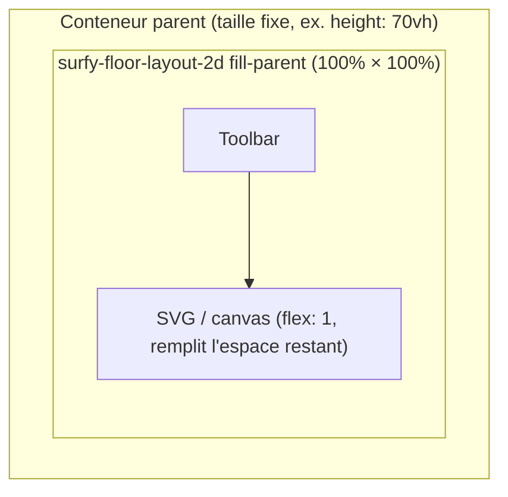

# Taille et conteneur

Les éléments de layout (`surfy-floor-layout-2d`, `surfy-floor-layout-3d`, `surfy-building-layout-3d`) sont des blocs `display: block`. Leur taille dépend du **conteneur parent**.

## Hauteur fixe ou relative

```html
<style>
  .plan-container {
    width: 100%;
    height: 70vh;
    min-height: 400px;
    border: 1px solid #ddd;
  }

  .plan-container surfy-floor-layout-2d {
    display: block;
    width: 100%;
    height: 100%;
  }
</style>

<div class="plan-container">
  <surfy-floor-layout-2d
    floor-id="10065"
    tenant="surfy-demo"
    base-url="https://app.surfy.pro"
  ></surfy-floor-layout-2d>
</div>
```

Le SDK utilise un `ResizeObserver` : le plan se redimensionne quand le conteneur change (2D et 3D).

## Attribut `fill-parent`

Fait en sorte que la **carte SVG** (ou le canvas 3D) occupe **100 % de la largeur et de la hauteur** du conteneur parent. L'attribut ne modifie **pas** la taille du parent : celui-ci doit déjà avoir des dimensions explicites.



### Conteneur à taille fixe (démo)

```html
<style>
  .plan-host {
    width: 100%;
    height: 70vh;
    min-height: 420px;
  }

  .plan-host surfy-floor-layout-2d {
    display: block;
    width: 100%;
    height: 100%;
  }
</style>

<div class="plan-host">
  <surfy-floor-layout-2d
    fill-parent
    floor-id="10065"
    tenant="surfy-demo"
    base-url="https://app.surfy.pro"
  ></surfy-floor-layout-2d>
</div>
```

### Conteneur flex (plein écran)

Pour occuper **tout l'espace disponible** du parent (flex, grid, etc.) :

```html
<div class="layout" style="display: flex; flex-direction: column; height: 100vh;">
  <nav>...</nav>
  <div class="plan-host" style="flex: 1; min-height: 0;">
    <surfy-floor-layout-2d
      fill-parent
      floor-id="10065"
      tenant="surfy-demo"
      base-url="https://app.surfy.pro"
    ></surfy-floor-layout-2d>
  </div>
</div>
```

| Sans `fill-parent` | Avec `fill-parent` |
|------------------|-------------------|
| Carte en hauteur minimale (~240px) dans le shadow | Élément + SVG en `100%` largeur/hauteur du parent |
| Toolbar + carte en flux naturel | Toolbar fixe, carte SVG en `flex: 1` sur tout l'espace restant |

:::note Parent dimensionné
Le parent doit avoir une **hauteur définie** (`height`, `70vh`, `flex: 1` + `min-height: 0`, etc.). `fill-parent` étire la carte **à l'intérieur** de ce cadre ; il n'agrandit pas le conteneur.
:::

## Activer / désactiver dynamiquement

```ts
const el = document.querySelector('surfy-floor-layout-2d')!;

el.setAttribute('fill-parent', '');
// el.removeAttribute('fill-parent');
```

## Polices et icônes de la toolbar (2D)

La barre d'outils (zoom, fit) utilise MUI dans le Shadow DOM. Le SDK :

1. Injecte les styles **Emotion** dans le shadow root
2. Charge les feuilles `{base-url}/assets/fontawesome/...`, `surfyicon`, `icomoon`

Assurez-vous que `base-url` pointe vers une instance Surfy qui sert `/assets/` (même origine que l'API).

## Erreurs de mise en page fréquentes

| Symptôme | Cause | Correction |
|----------|-------|------------|
| Plan invisible (hauteur 0) | Parent sans hauteur | Donner `height` ou `flex: 1` au conteneur |
| Icônes toolbar cassées | `base-url` incorrect | Vérifier l'URL et l'accès à `/assets/` |
| Plan trop petit | `min-height` absent | `min-height: 400px` ou plus sur le conteneur |
| Canvas 3D noir | Conteneur sans dimensions | Même règles que 2D — CubyV2 a besoin d'une taille explicite |
