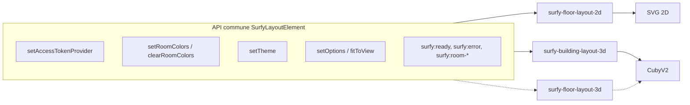
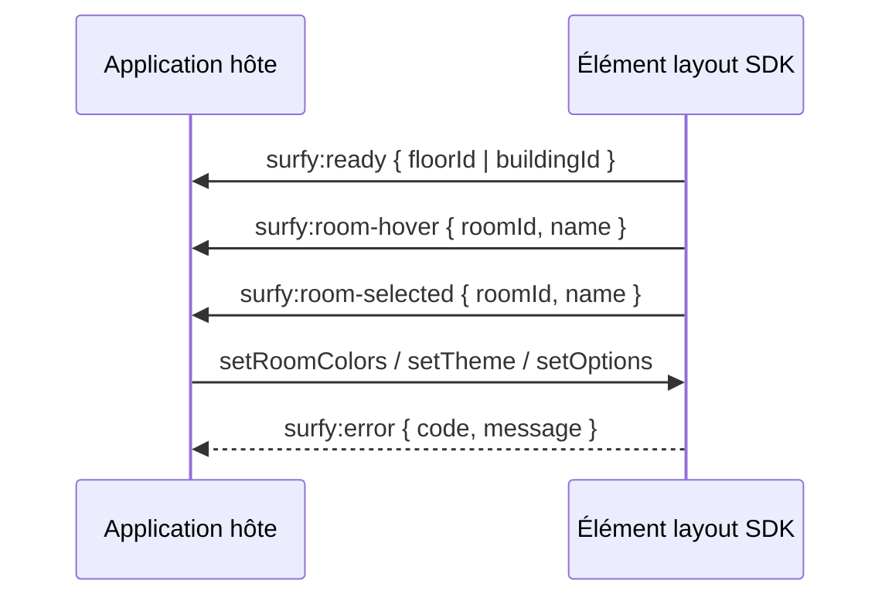

# Éléments de layout — API publique

Le SDK expose **trois Web Components** pour intégrer la cartographie Surfy. Ils partagent la **même API impérative** et le même modèle Shadow DOM.

| Élément | Rendu | Moteur | Statut |
|---------|-------|--------|--------|
| `<surfy-floor-layout-2d>` | Plan d'étage 2D (SVG) | `SimpleFloorLayoutViewer` | **Disponible** |
| `<surfy-building-layout-3d>` | Bâtiment 3D (multi-étages) | **CubyV2** | **Disponible** (alpha SDK) |
| `<surfy-floor-layout-3d>` | Plan d'étage 3D | **CubyV2** | Spécifié — tag pas encore enregistré |



---

## API commune (`SurfyLayoutElement`)

Tous les éléments implémentent la même interface TypeScript :

```ts
interface SurfyLayoutElement extends HTMLElement {
  setAccessTokenProvider(provider: () => Promise<string>): void;
  setRoomColors(colors: Record<number, string>): void;
  clearRoomColors(): void;
  setTheme(theme?: SurfyThemeOptions | null): void;
  setOptions(options: SurfyLayout3dOptions): void;
  fitToView(): void;
}
```

| Méthode | 2D | Bâtiment 3D | Description |
|---------|-----|-------------|-------------|
| `setAccessTokenProvider` | oui | oui | JWT Bearer — voir [Authentification](./authentication.md) |
| `setRoomColors` / `clearRoomColors` | oui | oui | Voir [Couleurs](./room-colors.md) |
| `setTheme` | oui | oui | Voir [Thème](./theme.md) |
| `setOptions` | no-op | oui | Voir [Options 3D](./options-3d.md) |
| `fitToView` | stub | oui | Recentre la caméra (bâtiment 3D) |

### Attributs communs

| Attribut | Requis | Description |
|----------|--------|-------------|
| `tenant` | oui | Slug tenant (`x-tenant`) |
| `base-url` | oui | Origine API Surfy, sans slash final |
| `locale` | non | `accept-language`, défaut `en` |
| `fill-parent` | non | Occupe 100 % largeur/hauteur du parent — voir [Taille](./layout-and-sizing.md) |

### Événements DOM

`CustomEvent` avec `bubbles: true`, écoutés sur l'élément hôte.



| Événement | `detail` |
|-----------|----------|
| `surfy:ready` | Voir sections par élément |
| `surfy:error` | `{ code: SurfySdkErrorCode, message: string }` |
| `surfy:room-selected` | `{ roomId: number, name: string }` |
| `surfy:room-hover` | `{ roomId: number, name: string }` ou `null` |

### Codes d'erreur (`SurfySdkErrorCode`)

`AUTH_EXPIRED` · `AUTH_FORBIDDEN` · `TENANT_MISMATCH` · `LAYOUT_NOT_FOUND` · `NETWORK` · `SDK_CONFIG`

---

## `<surfy-floor-layout-2d>`

Plan d'étage **2D** interactif (zoom, sélection d'espaces, toolbar MUI).

### Attributs spécifiques

| Attribut | Requis | Description |
|----------|--------|-------------|
| `floor-id` | oui | Identifiant numérique de l'étage |

### `surfy:ready`

```ts
{ floorId: number }
```

### Exemple

```html
<div style="width: 100%; height: 500px;">
  <surfy-floor-layout-2d
    floor-id="10065"
    tenant="surfy-demo"
    base-url="https://app.surfy.pro"
    locale="fr"
    fill-parent
  ></surfy-floor-layout-2d>
</div>
```

```ts
const el = document.querySelector('surfy-floor-layout-2d')!;

el.setAccessTokenProvider(async () => /* JWT */);
el.addEventListener('surfy:ready', () => {
  el.setRoomColors({ 577183: '#2196F3' });
  el.setTheme({ primary: { main: '#0277bd' } });
});
```

### HTTP

| | |
|--|--|
| Méthode | `POST` |
| URL | `{base-url}/api/v1/layout/floor/data` |
| Corps | `{ "floorId": <number> }` |

---

## `<surfy-building-layout-3d>`

Vue **3D** d'un **bâtiment entier** (plusieurs étages empilés), rendue par **CubyV2**.

### Attributs spécifiques

| Attribut | Requis | Description |
|----------|--------|-------------|
| `building-id` | oui | Identifiant numérique du bâtiment |

### `surfy:ready`

```ts
{ buildingId: number }
```

### Exemple complet

```html
<div class="plan-host" style="width: 100%; height: 70vh; min-height: 420px;">
  <surfy-building-layout-3d
    building-id="42"
    tenant="surfy-demo"
    base-url="https://app.surfy.pro"
    fill-parent
  ></surfy-building-layout-3d>
</div>
```

```ts
import type { SurfyBuildingLayout3dElement } from '@surfy/surfy-sdk';

const el = document.querySelector('surfy-building-layout-3d') as SurfyBuildingLayout3dElement;

el.setAccessTokenProvider(async () => /* JWT */);

el.setOptions({
  floorSpace: 240,
  showRoomLabels: true,
  showFloorLabels: true,
});

el.addEventListener('surfy:ready', () => {
  el.fitToView();
});

el.addEventListener('surfy:room-selected', (e) => {
  console.log('Espace', e.detail.roomId, e.detail.name);
});
```

### HTTP

| | |
|--|--|
| Méthode | `POST` |
| URL | `{base-url}/api/v1/layout/buildings/data` |
| Corps | `{ "buildingIds": [<buildingId>] }` |

Les couleurs, thème et événements `surfy:room-*` utilisent les **mêmes `roomId`** que les vues étage.

Options d'affichage : [Options 3D](./options-3d.md).

---

## `<surfy-floor-layout-3d>`

Vue **3D** d'un **seul étage** (CubyV2). L'API est **spécifiée** et alignée sur `SurfyLayoutElement` ; l'enregistrement du custom element dans `@surfy/surfy-sdk` est **à venir** (constante `SURFY_FLOOR_LAYOUT_3D_TAG` déjà exportée).

### Attributs spécifiques (prévus)

| Attribut | Requis | Description |
|----------|--------|-------------|
| `floor-id` | oui | Identifiant de l'étage |

### `surfy:ready` (prévu)

```ts
{ floorId: number }
```

### HTTP (prévu)

Même endpoint que le 2D : `POST {base-url}/api/v1/layout/floor/data` avec `{ floorId }`.

:::info À venir
Vérifiez `SURFY_SDK_VERSION` et le changelog avant intégration. En attendant, la démo **surfy-sdk-demos** réserve l'onglet « Étage 3D » pour ce tag.
:::

---

## TypeScript

Types exportés depuis `@surfy/surfy-sdk` :

```ts
import type {
  SurfyLayoutElement,
  SurfyFloorLayout2dElement,
  SurfyFloorLayout3dElement,
  SurfyBuildingLayout3dElement,
  SurfyThemeOptions,
  SurfyLayout3dOptions,
  SurfyLayout3dWallMode,
  SurfyFloorLayout2dReadyDetail,
  SurfyBuildingLayout3dReadyDetail,
  SurfyRoomSelectedDetail,
  SurfySdkErrorCode,
} from '@surfy/surfy-sdk';

declare global {
  interface HTMLElementTagNameMap {
    'surfy-floor-layout-2d': SurfyFloorLayout2dElement;
    'surfy-floor-layout-3d': SurfyFloorLayout3dElement;
    'surfy-building-layout-3d': SurfyBuildingLayout3dElement;
  }
}
```

## Shadow DOM

| Élément | Contenu shadow |
|---------|----------------|
| 2D | SVG + toolbar MUI |
| Bâtiment 3D | Canvas WebGL CubyV2 + handlers (espacement, labels, rotation) |

Styles et polices injectés dans le shadow root ; le CSS de votre page n'affecte pas l'intérieur. Voir [Taille et conteneur](./layout-and-sizing.md).

## Versioning

- Changement cassant sur attributs / méthodes / `detail` → **major** npm.
- Ajout d'options ou d'éléments sans rupture 2D → **minor**.
- En-tête `X-Surfy-Sdk-Version` sur les requêtes layout.
