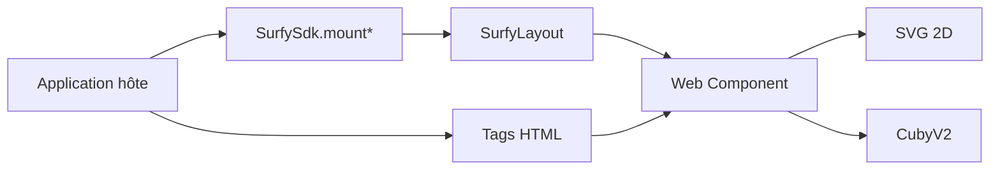

# Layouts — API JavaScript et Web Components

Deux façons d'embarquer le **même** rendu (Shadow DOM) :

1. **API JavaScript** — `SurfySdk.mountFloor2d` / `SurfySdk.mountBuilding3d` (recommandée hors React)
2. **Web Component** — tags HTML + méthodes / événements DOM

Pour une app React, préférez [Surfy React Web](./surfy-react-web.md).

| Kind / tag | Rendu | Statut |
|------------|-------|--------|
| `floor-2d` / `<surfy-floor-layout-2d>` | Plan d'étage 2D (SVG) | **Disponible** |
| `building-3d` / `<surfy-building-layout-3d>` | Bâtiment 3D multi-étages (CubyV2) | **Disponible** (alpha SDK) |

```ts
import { SurfySdk } from '@surfy/surfy-sdk';

const layout = SurfySdk.mountBuilding3d({
  container: '#map', // HTMLElement ou sélecteur CSS
  tenant: 'mon-tenant',
  baseUrl: 'https://app.surfy.pro',
  buildingId: 42,
  getAccessToken: () => fetchToken(),
  onReady: () => console.log('ready'),
  onError: (err) => console.error(err),
});

layout.setRoomColors({ 1001: '#2196F3' });
layout.setOptions({ showRoomLabels: true });
layout.fitToView();
layout.destroy();
```


```mermaid
flowchart LR
  App["Application hôte"] --> Mount["SurfySdk.mount*"]
  App --> WC["Tags HTML"]
  Mount --> Handle["SurfyLayout"]
  Handle --> CE["Web Component"]
  WC --> CE
  CE --> SVG["SVG 2D"]
  CE --> Cuby["CubyV2"]
```

## `SurfyLayout` (handle `mount*`)

| Méthode | Description |
|---------|-------------|
| `setAccessTokenProvider` | JWT Bearer — voir [Authentification](./authentication.md) |
| `setRoomColors` / `clearRoomColors` | Voir [Couleurs](./room-colors.md) |
| `updateRoom` | Voir [updateRoom](./update-room.md) |
| `setTheme` | Voir [Thème](./theme.md) |
| `setOptions` / `fitToView` / `zoomOn` | Voir [Options 3D](./options-3d.md) (`setOptions` no-op en 2D) |
| `setFillParent` | Remplir le conteneur |
| `setEntityId` | Changer `floorId` / `buildingId` |
| `getRenderedRoomIds` | Ids d'espaces présents dans le DOM rendu |
| `destroy` | Retire l'élément et les listeners |

Helpers : `SurfySdk.isKindRegistered(kind)`, `SurfySdk.tagForKind(kind)`, `SurfySdk.version`.

### Options `mountFloor2d`

| Champ | Requis | Description |
|-------|--------|-------------|
| `container` | oui | `HTMLElement` ou sélecteur |
| `tenant` | oui | Slug tenant |
| `baseUrl` | oui | Origine API sans slash final |
| `floorId` | oui | Id étage |
| `getAccessToken` | oui | `() => Promise<string>` |
| `locale` / `fillParent` / `theme` | non | Locale, sizing, thème |
| `onReady` / `onRoomHover` / `onRoomSelected` / `onError` | non | Callbacks typés |

### Options `mountBuilding3d`

Comme ci-dessus avec `buildingId` (requis), plus `floorIds?` (sous-ensemble d'étages) et `options?` (`SurfyLayout3dOptions`).

Le SDK vérifie `window` / `document` et lève `SDK_CONFIG` si le tag n'est pas enregistré ou si le conteneur est invalide.

## Web Component

```html
<surfy-floor-layout-2d
  floor-id="10065"
  tenant="mon-tenant"
  base-url="https://app.surfy.pro"
  fill-parent
></surfy-floor-layout-2d>
```

```ts
import '@surfy/surfy-sdk'; // enregistre les tags
import type { SurfyLayoutElement } from '@surfy/surfy-sdk';

const el = document.querySelector('surfy-floor-layout-2d') as SurfyLayoutElement;
el.setAccessTokenProvider(() => fetchToken());
el.addEventListener('surfy:ready', () => {
  el.setRoomColors({ 577183: '#2196F3' });
});
```

### Attributs communs

| Attribut | Requis | Description |
|----------|--------|-------------|
| `tenant` | oui | Slug tenant (`x-tenant`) |
| `base-url` | oui | Origine API, sans slash final |
| `locale` | non | `accept-language`, défaut `en` |
| `fill-parent` | non | 100 % du parent — voir [Taille](./layout-and-sizing.md) |
| `floor-id` | 2D | Id étage |
| `building-id` | bâtiment 3D | Id bâtiment |

### Événements DOM

| Événement | `detail` (indicatif) |
|-----------|----------------------|
| `surfy:ready` | Identifiant layout prêt |
| `surfy:error` | `{ code, message }` |
| `surfy:room-selected` | `{ roomId, name }` |
| `surfy:room-hover` | `{ roomId, name }` ou `null` |

Les callbacks de `mount*` remplacent `addEventListener` pour le même contrat.

### Escape hatch

`layout.element` expose le custom element (`SurfyLayoutElement`) pour tests ou usages avancés.

Voir aussi [Installation](./installation.md), [Authentification](./authentication.md), [Taille](./layout-and-sizing.md).
