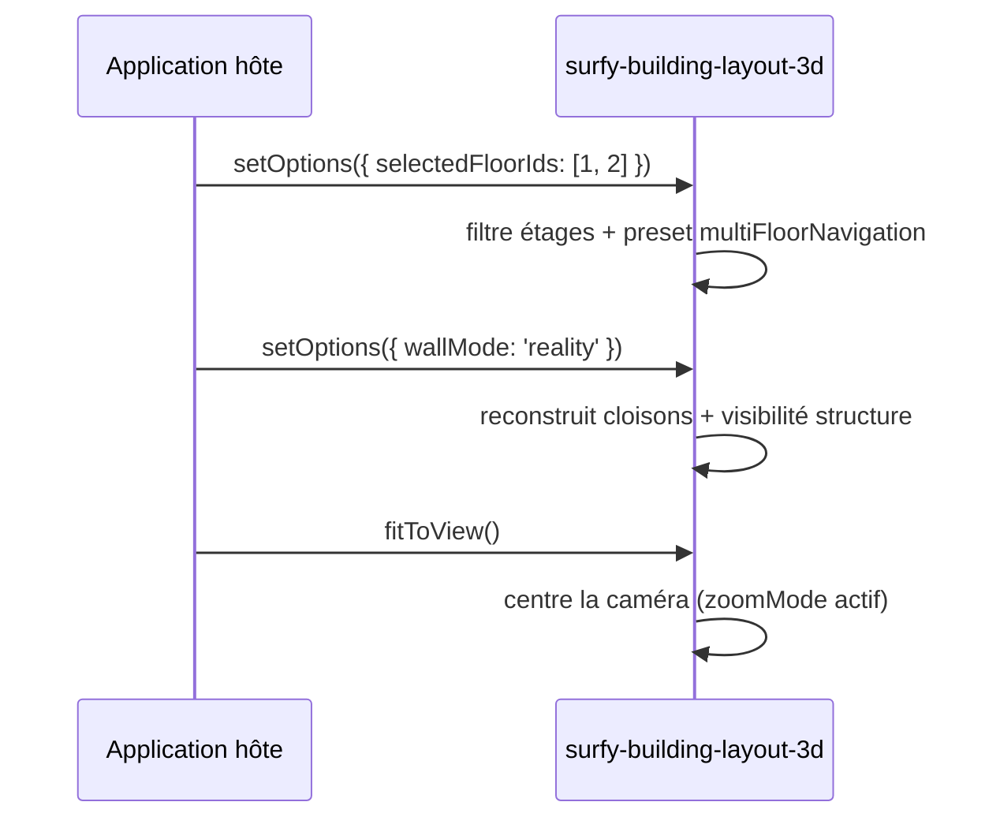

# Options 3D (`setOptions` / `fitToView`)

Les vues **CubyV2** exposent des réglages d'affichage via `setOptions`. Les appels sont **fusionnés** : chaque invocation ne met à jour que les clés fournies.

| Élément | `setOptions` | `fitToView` |
|---------|--------------|-------------|
| `<surfy-floor-layout-2d>` | ignoré (no-op) | stub (non implémenté) |
| `<surfy-floor-layout-3d>` | prévu (élément pas encore enregistré) | prévu |
| `<surfy-building-layout-3d>` | **disponible** | **disponible** |

## `setOptions(options)`

```ts
import type { SurfyLayout3dOptions, SurfyBuildingLayout3dElement } from '@surfy/surfy-sdk';

const building = document.querySelector('surfy-building-layout-3d') as SurfyBuildingLayout3dElement;

building.addEventListener('surfy:ready', () => {
  building.setOptions({
    floorSpace: 320,
    showRoomLabels: false,
    showFloorLabels: true,
    buildingRotationZ: 15,
    selectedFloorIds: [101, 102],
    wallMode: 'cuby',
    showStructureWalls: true,
    structureFloorIds: [101],
    singleFloorNavigation: { controls: 'map', zoomMode: 'zenith' },
    multiFloorNavigation: { controls: 'building', zoomMode: 'isometric' },
  });
});
```

Vous pouvez appeler `setOptions` **avant** `surfy:ready` : les valeurs sont conservées et appliquées au chargement de la scène.

## Type `SurfyLayout3dOptions`

| Option | Type | Défaut | Description |
|--------|------|--------|-------------|
| `floorSpace` | `number` | `240` | Espacement vertical entre étages (px) |
| `showRoomLabels` | `boolean` | `true` | Libellés des espaces dans la scène |
| `showFloorLabels` | `boolean` | `true` | Libellés des étages |
| `buildingRotationZ` | `number` | `0` | Rotation du bâtiment autour de Z (degrés) |
| `selectedFloorIds` | `number[]` | tous les étages du layout | Étages visibles |
| `wallMode` | `SurfyLayout3dWallMode` | `'cuby'` | Mode de rendu des cloisons |
| `showStructureWalls` | `boolean` | `false` | Afficher les structures du bâtiment |
| `structureFloorIds` | `number[]` | tous les étages visibles | Étages dont la structure est affichée |
| `singleFloorNavigation` | `SurfyLayout3dNavigationOptions` | `{ controls: 'map', zoomMode: 'zenith' }` | Navigation quand **un** étage est sélectionné |
| `multiFloorNavigation` | `SurfyLayout3dNavigationOptions` | `{ controls: 'building', zoomMode: 'isometric' }` | Navigation quand **plusieurs** étages sont visibles |

### `wallMode` (`SurfyLayout3dWallMode`)

| Valeur | Description |
|--------|-------------|
| `'cuby'` | Style cartographie Cuby (défaut embed SDK) — masque postes, mobilier et structures |
| `'no'` | Sans murs |
| `'half'` | Murs demi-hauteur |
| `'reality'` | Rendu « réaliste » |
| `'cuby-reality-selected'` | Mobilier/postes uniquement dans les espaces sélectionnés |
| `'no-wall-selected'` | Comme ci-dessus, sans murs sur les espaces non sélectionnés |

### Structure

`showStructureWalls` contrôle la visibilité des maillages de structure (dalle + murs si créés au chargement).
`structureFloorIds` permet de limiter l'affichage à certains étages. Omettre la clé équivaut à « tous les étages visibles ».

:::note Géométrie des murs de structure
Les murs de structure ne sont générés qu'au **premier chargement** si `showStructureWalls` est `true`. Un basculement ultérieur affiche ou masque le groupe 3D existant.
:::

### Navigation (`SurfyLayout3dNavigationOptions`)

| Clé | Type | Valeurs | Rôle |
|-----|------|---------|------|
| `controls` | `SurfyLayout3dControls` | `'map'` · `'orbit'` · `'building'` | Schéma de manipulation caméra |
| `zoomMode` | `SurfyLayout3dZoomMode` | `'zenith'` · `'isometric'` | Cadrage par défaut (`fitToView` / changement d'étages) |

Le preset **single** s'applique lorsqu'un seul étage est dans `selectedFloorIds` ; le preset **multi** lorsque plusieurs étages sont visibles.

## Mise à jour dynamique

```ts
// Masquer un étage
building.setOptions({ selectedFloorIds: [102] });

// Passer en mode réaliste avec structures sur l'étage 102
building.setOptions({
  wallMode: 'reality',
  showStructureWalls: true,
  structureFloorIds: [102],
});

// Navigation orbit + vue isométrique en multi-étages
building.setOptions({
  multiFloorNavigation: { controls: 'orbit', zoomMode: 'isometric' },
});
building.fitToView();
```



## `fitToView()`

Recentre la caméra sur la scène 3D courante (étages sélectionnés, espacement, rotation et `zoomMode` du preset actif pris en compte).

```ts
building.fitToView();
```

Utile après un changement de `selectedFloorIds`, de `floorSpace`, de navigation (`zoomMode`) ou de taille du conteneur.

:::tip Démo
**surfy-sdk-demos** — onglet « Bâtiment 3D » : panneau **Options 3D** avec étages, wall mode, structure par étage et presets de navigation.
:::

## Ce qui n'est pas exposé

Les options internes du Work Canvas Surfy (filtres carte, calques d'analyse, sélecteur d'étages UI, etc.) ne sont **pas** configurables via le SDK. Seules les clés de `SurfyLayout3dOptions` sont le contrat public.

Voir [Éléments de layout — bâtiment 3D](./layout-elements.md#surfy-building-layout-3d) et [Taille et conteneur](./layout-and-sizing.md).
