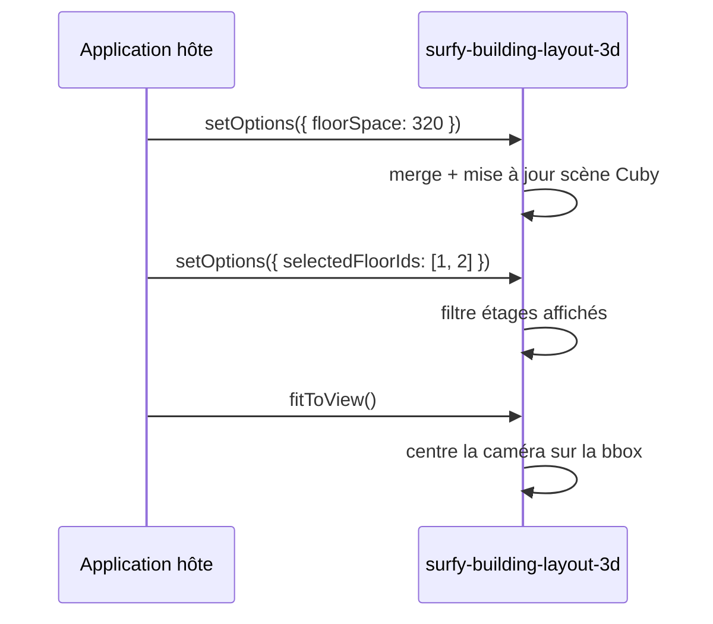

# Options 3D (`setOptions` / `fitToView`)

Les vues **CubyV2** exposent des réglages d'affichage via `setOptions`. Les appels sont **fusionnés** : chaque invocation ne met à jour que les clés fournies.

| Élément | `setOptions` | `fitToView` |
|---------|--------------|-------------|
| `<surfy-floor-layout-2d>` | ignoré (no-op) | stub (non implémenté) |
| `<surfy-floor-layout-3d>` | prévu (élément pas encore enregistré) | prévu |
| `<surfy-building-layout-3d>` | **disponible** | **disponible** |

## `setOptions(options)`

```ts
import type { SurfyLayout3dOptions, SurfyBuildingLayout3dElement } from '@surfy/surfy-sdk';

const building = document.querySelector('surfy-building-layout-3d') as SurfyBuildingLayout3dElement;

building.addEventListener('surfy:ready', () => {
  building.setOptions({
    floorSpace: 320,
    showRoomLabels: false,
    showFloorLabels: true,
    buildingRotationZ: 15,
    selectedFloorIds: [101, 102],
    wallMode: 'cuby',
  });
});
```

Vous pouvez appeler `setOptions` **avant** `surfy:ready` : les valeurs sont conservées et appliquées au chargement de la scène.

## Type `SurfyLayout3dOptions`

| Option | Type | Défaut | Description |
|--------|------|--------|-------------|
| `floorSpace` | `number` | `240` | Espacement vertical entre étages (px) |
| `showRoomLabels` | `boolean` | `true` | Libellés des espaces dans la scène |
| `showFloorLabels` | `boolean` | `true` | Libellés des étages |
| `buildingRotationZ` | `number` | `0` | Rotation du bâtiment autour de Z (degrés) |
| `selectedFloorIds` | `number[]` | tous les étages du layout | Étages visibles |
| `wallMode` | `SurfyLayout3dWallMode` | `'cuby'` | Mode de rendu des cloisons |

### `wallMode` (`SurfyLayout3dWallMode`)

| Valeur | Description |
|--------|-------------|
| `'cuby'` | Style cartographie Cuby (défaut embed SDK) |
| `'no'` | Sans murs |
| `'half'` | Murs demi-hauteur |
| `'reality'` | Rendu « réaliste » |

## Mise à jour dynamique

```ts
// Écarter les étages après interaction utilisateur
building.setOptions({ selectedFloorIds: [102] });

// Augmenter l'espacement pour une présentation
building.setOptions({ floorSpace: 400 });

// Masquer les libellés d'espaces
building.setOptions({ showRoomLabels: false });
```



## `fitToView()`

Recentre la caméra sur la scène 3D courante (étages sélectionnés, espacement, rotation pris en compte).

```ts
building.fitToView();
```

Utile après un changement de `selectedFloorIds`, de `floorSpace` ou de taille du conteneur.

:::tip Démo
**surfy-sdk-demos** — onglet « Bâtiment 3D » : la scène charge tous les étages par défaut ; vous pouvez reproduire les appels ci-dessus depuis la console une fois `surfy:ready` émis.
:::

## Ce qui n'est pas exposé

Les options internes du Work Canvas Surfy (filtres carte, calques d'analyse, sélecteur d'étages UI, etc.) ne sont **pas** configurables via le SDK. Seules les clés de `SurfyLayout3dOptions` sont le contrat public.

Voir [Éléments de layout — bâtiment 3D](./layout-elements.md#surfy-building-layout-3d) et [Taille et conteneur](./layout-and-sizing.md).
