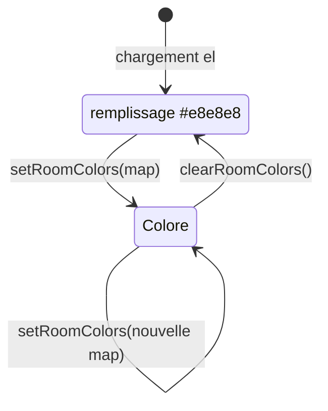

# Couleurs des espaces

Coloriez un ou plusieurs espaces via `setRoomColors`. L'API est **identique** sur les trois éléments de layout (2D SVG et 3D CubyV2).

## Usage de base

```ts
const el = document.querySelector('surfy-floor-layout-2d')!;

// Attendre que le el soit prêt
el.addEventListener('surfy:ready', () => {
  el.setRoomColors({
    577183: '#2196F3',
  });
});
```

Les clés sont les **identifiants numériques des espaces** (`roomId`), pas les noms affichés.

## Plusieurs espaces en un appel

```ts
el.setRoomColors({
  577183: '#2196F3', // bleu
  577181: '#4CAF50', // vert
  577219: '#F44336', // rouge
});
```

Chaque valeur est une couleur CSS valide (`#hex`, `rgb()`, `hsl()`, noms CSS).

## Comportement



| Action | Effet |
|--------|--------|
| `setRoomColors(colors)` | **Remplace** tout le jeu de couleurs intégrateur (pas un ajout partiel) |
| `clearRoomColors()` | Retour au remplissage par défaut `#e8e8e8` |
| Nouvel appel partiel | Fusionnez vous-même avec l'état précédent |

### Mise à jour incrémentale (pattern hôte)

```ts
let currentColors: Record<number, string> = {};

function colorRoom(roomId: number, color: string) {
  currentColors = { ...currentColors, [roomId]: color };
  el.setRoomColors(currentColors);
}

function removeRoomColor(roomId: number) {
  const { [roomId]: _, ...rest } = currentColors;
  currentColors = rest;
  el.setRoomColors(currentColors);
}
```

## Couleur après sélection utilisateur

```ts
let selectedRoomId: number | undefined;

el.addEventListener('surfy:room-selected', (e) => {
  selectedRoomId = e.detail.roomId;
});

document.getElementById('highlight-btn')!.addEventListener('click', () => {
  if (selectedRoomId !== undefined) {
    el.setRoomColors({ [selectedRoomId]: '#FF9800' });
  }
});
```

## Trouver les ids d'espaces

- Événements `surfy:room-selected` / `surfy:room-hover` : `detail.roomId`
- DOM shadow (debug) : `[data-room-id]` sur les groupes SVG d'espaces
- API layout : champ `rooms[].id` dans la réponse `layout/floor/data`

:::tip Démo
Le projet **surfy-sdk-demos** colore dynamiquement le premier espace rendu ou celui sélectionné par l'utilisateur.
:::

## Limites

- **2D** : seul le **remplissage** (`fill`) des polygones d'espaces est surchargé, pas les traits ni les icônes d'équipements.
- **Bâtiment 3D** : `setRoomColors` surcharge les **matériaux des pièces** CubyV2 (même sémantique `roomId`).
- Pas de dégradé ni de motif : couleur unie par espace.
- Les couleurs métier Surfy (centre de coût, calques d'analyse) ne sont pas exposées — utilisez `setRoomColors` pour votre propre sémantique.
